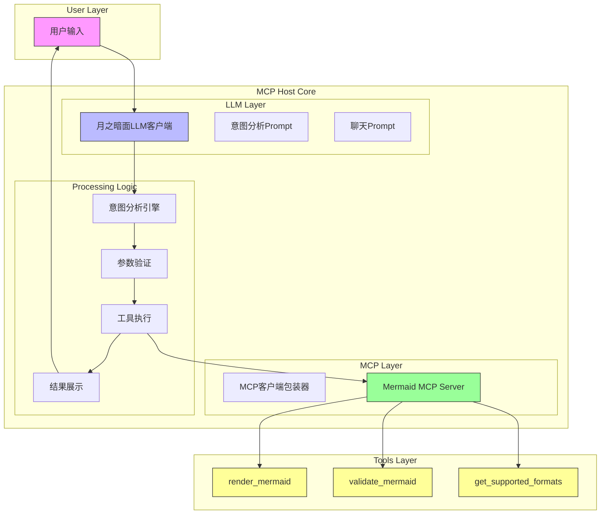
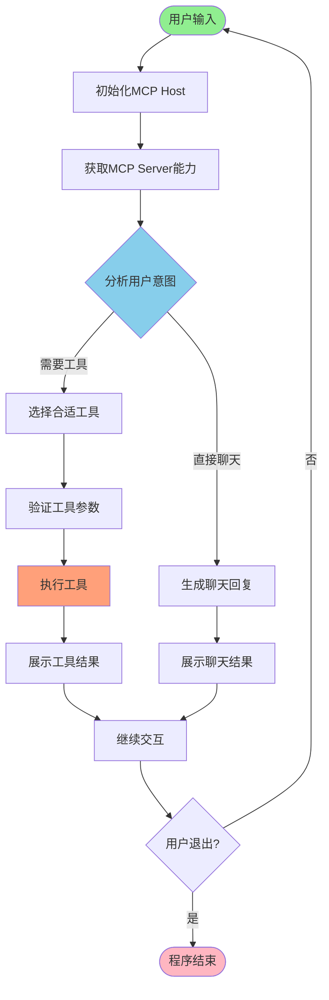
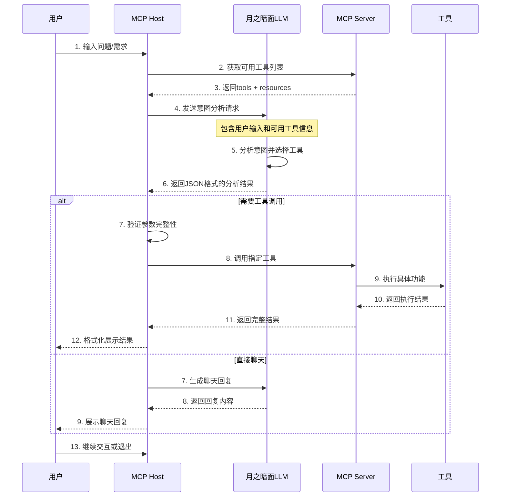

# MCP Host 架构设计与工作流程分析

## 概述

MCP Host是一个通用的MCP客户端，采用智能意图分析机制，能够根据用户输入自动选择并调用合适的工具。该设计遵循零硬编码原则，支持任意MCP Server的即插即用。

## 系统架构图

### 整体架构



### 用户输入处理流程



### 详细时序图



## 核心工作流程

### 1. 系统启动阶段

- **配置文件加载**：从`config/config.json`读取配置
- **日志系统初始化**：配置控制台和文件日志
- **MCP Server连接**：建立与MCP Server的通信连接
- **能力分析**：获取并缓存可用工具和资源列表

### 2. 意图分析阶段

#### 2.1 输入预处理
- 清理用户输入文本
- 检测空输入和特殊命令（quit/exit）
- 构建完整的上下文环境

#### 2.2 工具选择逻辑
- **置信度评估**：基于用户输入和工具描述计算匹配度
- **参数自动生成**：LLM根据工具schema生成完整参数
- **错误处理**：处理参数缺失和格式错误

### 3. 执行阶段

#### 3.1 参数验证
- 检查必需参数是否完整
- 验证参数类型和格式
- 提供详细的错误信息

#### 3.2 工具调用
- 通过MCP协议调用指定工具
- 处理执行过程中的异常
- 收集完整的执行结果

#### 3.3 结果展示
- 统一的工具结果展示格式
- 详细的参数和错误信息显示
- 支持长内容的截断展示

## Prompt系统设计

### 系统Prompt模板

#### 1. 通用聊天Prompt
```
你是一个智能助手，可以回答各种问题，提供建议，帮助用户解决各种问题。

当用户询问关于工具、功能或其他问题时，请直接回答。

保持回答简洁、有用、友好。
```

#### 2. 工具分析Prompt（核心）
```
你是一个严格的JSON格式分析器，必须返回有效的JSON格式，不允许返回任何其他格式的文本。

当前可用的工具详情：
{tools_json}

当前可用的资源详情：
{resources_json}

**任务**：分析用户输入，返回一个严格的JSON对象，格式如下：
```json
{
    "requires_tool": true,
    "selected_tool": "具体的工具名称",
    "confidence": 0.9,
    "reasoning": "选择这个工具的原因",
    "direct_response": "",
    "tool_parameters": {"参数名": "参数值"},
    "tool_description": "工具功能描述"
}
```

或者当不需要工具时：
```json
{
    "requires_tool": false,
    "selected_tool": "none",
    "confidence": 0.0,
    "reasoning": "为什么不需要工具",
    "direct_response": "直接回复用户的聊天内容",
    "tool_parameters": {},
    "tool_description": ""
}
```

**规则**：
1. 必须返回有效的JSON对象
2. requires_tool必须是布尔值true/false
3. selected_tool必须是字符串，且必须是可用工具列表中的工具名称，或者"none"
4. confidence必须是0.0到1.0之间的浮点数
5. tool_parameters必须根据所选工具的input_schema填写所有必需参数
6. 不要返回任何解释性文字，只返回JSON
7. 确保JSON格式正确转义所有特殊字符

**可用工具列表**：{tool_names}

请严格按照上述格式返回，不要添加任何额外文字，确保JSON格式正确转义所有特殊字符。
```

### JSON解析策略

#### 多重解析机制
1. **代码块提取**：优先匹配```json```代码块
2. **大括号匹配**：智能提取完整的JSON对象
3. **错误修复**：自动修复常见的JSON格式错误
4. **回退机制**：提供智能的默认响应

#### 格式错误处理
- 未转义的换行符 → 自动添加\n转义
- 未转义的引号 → 自动添加\